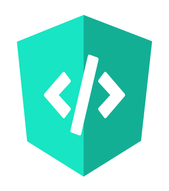

<!--
Created: Sun Oct 31 2021 16:45:19 GMT-0400 (hora de Bolivia)
Modified: Wed Mar 16 2022 20:55:10 GMT-0400 (hora de Bolivia)
-->
<p align="center">
  <a href="https://marketplace.visualstudio.com/items?itemName=MichaellAlavedraMunayco.angular-theme">
    
  </a>
</p>

<h1 align="center">
  Angular's VS Code themes
</h1>

<p align="center">
    <a href="https://github.com/MichaellAlavedraMunayco/angular-vscode-theme/issues">
        
    </a>
    <a href="https://github.com/MichaellAlavedraMunayco/angular-vscode-theme/">
        
    </a>
    <a href="https://github.com/MichaellAlavedraMunayco/angular-vscode-theme/">
        
    </a>
    <a href="https://github.com/MichaellAlavedraMunayco/angular-vscode-theme/">
        
    </a>
</p>


## Install

1. Go to [VS Marketplace](https://marketplace.visualstudio.com/items?itemName=MichaellAlavedraMunayco.angular-theme).
2. Click on the "Install" button.
3. Then [select a theme](https://code.visualstudio.com/docs/getstarted/themes#_selecting-the-color-theme).
    - `Angular Dark` (default)
    - `Angular Light`

## Preferred Settings

> For Angular VS Code Theme to work on HTML templates, please install the [vscode-angular-html](https://marketplace.visualstudio.com/items?itemName=ghaschel.vscode-angular-html) extension

I suggest adding this configuration to your VS Code `settings.json` file:

```json
{
    "editor.acceptSuggestionOnCommitCharacter": true,
    "editor.acceptSuggestionOnEnter": "smart",
    "editor.cursorWidth": 3,
    "editor.fontLigatures": true,
    "editor.fontWeight": "400",
    "editor.inlineSuggest.enabled": true,
    "editor.parameterHints.enabled": true,
    "editor.quickSuggestions": { "other": true, "comments": true, "strings": true },
    "editor.quickSuggestionsDelay": 3,
    "editor.renderControlCharacters": true,
    "editor.renderWhitespace": "all",
    "editor.suggest.preview": true,
    "editor.suggest.showStatusBar": true,
    "editor.suggestOnTriggerCharacters": true,
    "editor.suggestSelection": "first",
    "editor.tabCompletion": "on",
    "editor.wordBasedSuggestions": true,
}
```

## Override this theme

To override this (or any other) theme in your personal config file, please follow the guide in the [color theme](https://code.visualstudio.com/api/extension-guides/color-theme) documentation. This is handy for small tweaks to the theme without having to fork and maintain your own theme.
