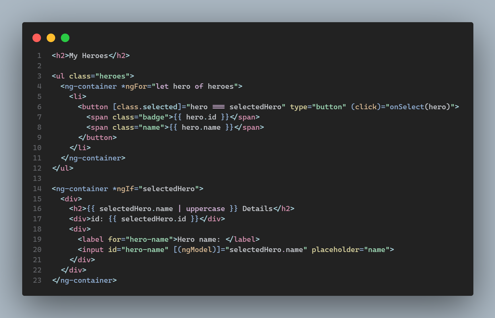
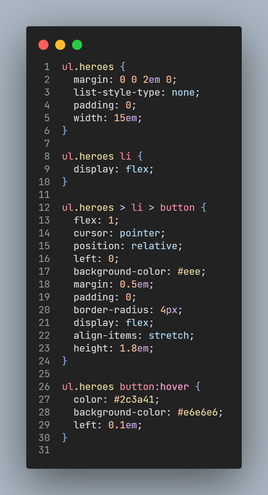
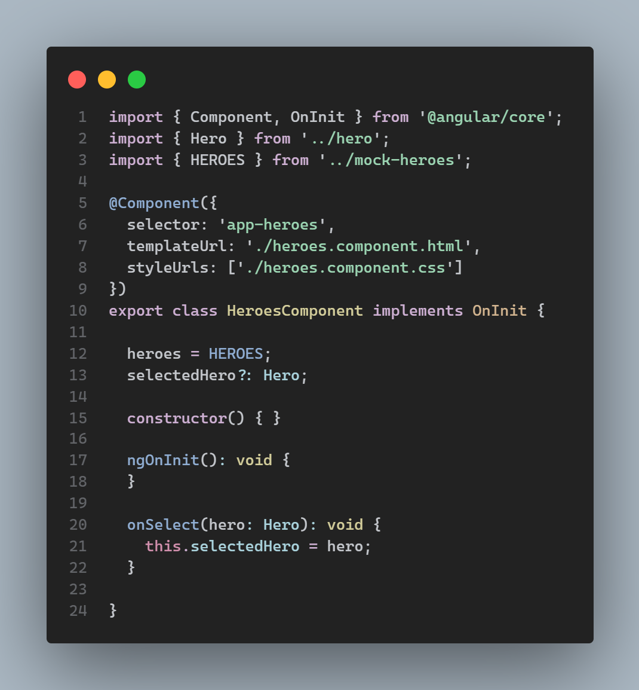

<!--
Created: Sun Oct 31 2021 16:45:19 GMT-0400 (hora de Bolivia)
Modified: Wed Mar 16 2022 20:55:10 GMT-0400 (hora de Bolivia)
-->

  

<h1 align="center">
  Angular VS Code Theme
</h1>

## Install

1. Go to [VS Marketplace](https://marketplace.visualstudio.com/items?itemName=MichaellAlavedraMunayco.angular-theme).
2. Click on the `Install` button.
3. Then [select](https://code.visualstudio.com/docs/getstarted/themes#_selecting-the-color-theme) a `Angular Dark Theme`.

## Override this theme

To override this (or any other) theme in your personal config file, please follow the guide in the [color theme](https://code.visualstudio.com/api/extension-guides/color-theme) documentation. This is handy for small tweaks to the theme without having to fork and maintain your own theme.
