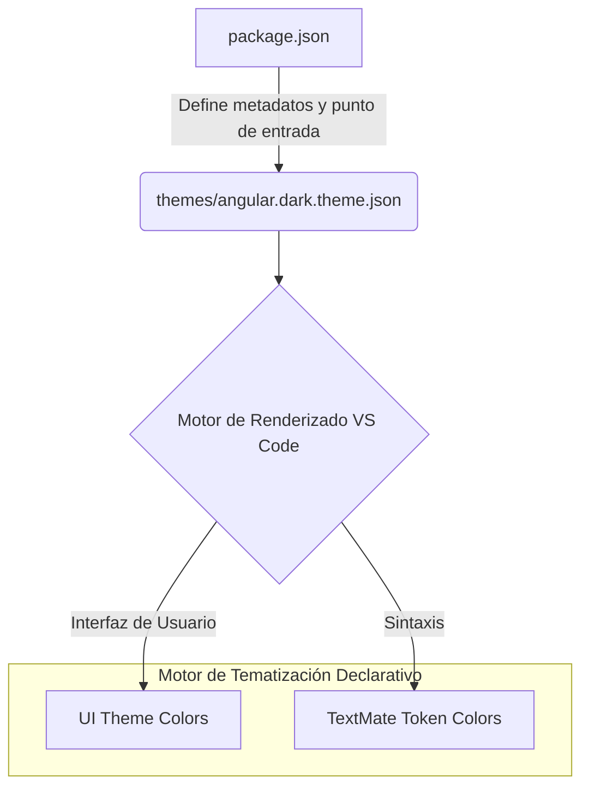
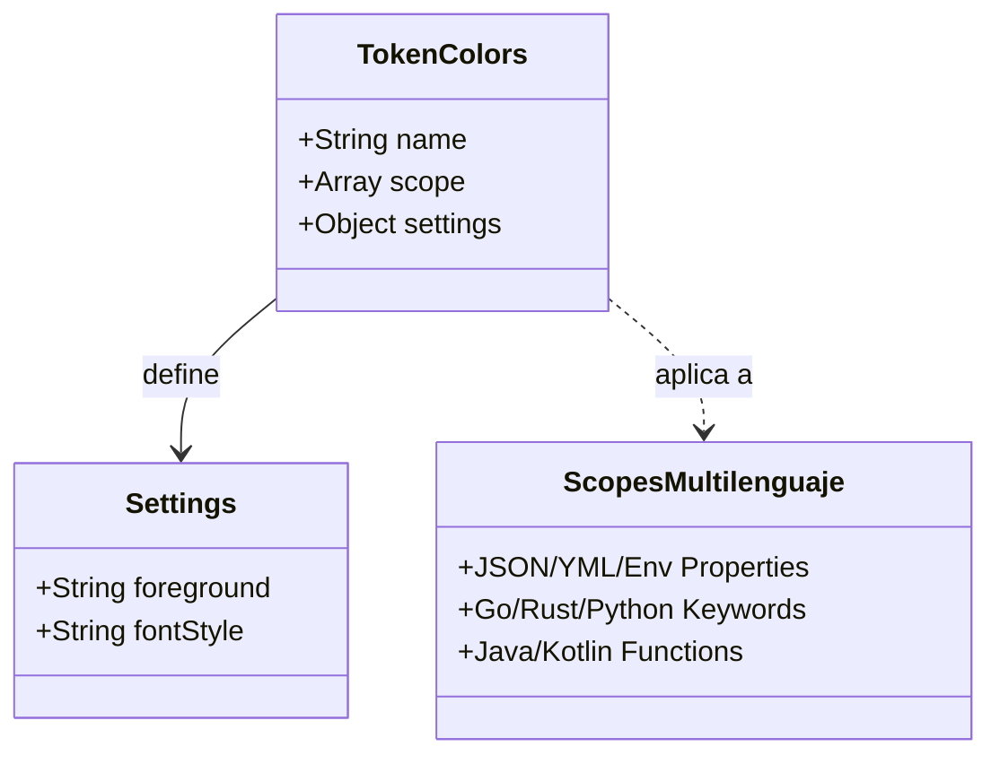

<!--
Created: Sun Oct 31 2021 16:45:19 GMT-0400 (hora de Bolivia)
Modified: Wed Mar 16 2022 20:55:10 GMT-0400 (hora de Bolivia)
-->

  

<h1 align="center">
  Angular VS Code Theme: Arquitectura y Diseño de Entorno
</h1>

Como arquitecto de software, entiendo que el entorno de desarrollo es tan crítico como el código que se escribe en él. La constante exposición a interfaces saturadas de estímulos visuales (negros absolutos y acentos cromáticos discordantes) genera una carga cognitiva innecesaria que merma el enfoque a lo largo de las sesiones de programación. Ante la falta de un entorno que cumpliera con mis estrictos estándares de legibilidad, serenidad visual y coherencia estructural, decidí diseñar esta solución.

Este documento expone el análisis, la utilidad y la arquitectura subyacente de **Angular Dark Theme**, una extensión para Visual Studio Code diseñada para redefinir el espacio de trabajo del desarrollador.

---

### Análisis del Problema y Utilidad de la Solución

El flujo de trabajo primario de cualquier ingeniero involucra la lectura intensiva de código, la identificación rápida de patrones sintácticos y la navegación entre múltiples vistas (árbol de archivos, terminal, editor). Los temas convencionales fallan en este aspecto por dos razones estructurales:
1. **Contraste de Alto Esfuerzo:** El uso del negro puro (`#000000`) contra texto brillante genera un efecto halo perjudicial para la vista.
2. **Jerarquía Visual Rota:** La sobreabundancia de acentos azules u otros colores saturados prioriza elementos secundarios sobre la semántica pura del código.

**Angular Dark Theme** resuelve este problema operativo aplicando una filosofía de diseño sustractivo, basada en los lineamientos estrictos de *Vercel UI* y *shadcn/ui*.

#### Flujo de Utilidad Operativa:
*   **Atenuación del Fondo:** Al inicializar el editor, el usuario es recibido por un fondo `#09090B` (un oscuro suave). Esto reduce inmediatamente la tensión ocular, permitiendo sesiones de lectura extendidas sin pérdida de concentración.
*   **Enfoque Monocromático:** La navegación por la barra lateral y la interacción con terminales o paneles ocurre en un espectro puramente monocromático (`#27272A`, `#52525B`, `#FAFAFA`). Al eliminar el ruido de color en la interfaz de usuario, el cerebro del desarrollador es guiado instintivamente hacia el área central donde reside el código.
*   **Resaltado Sintáctico Universal:** El desarrollador cambia entre archivos `.env`, configuración `json`, o lógica de backend en `python`, `go` o `rust`, y encuentra que los tokens semánticos mantienen una consistencia predecible. Esto reduce el esfuerzo mental necesario para parsear visualmente diferentes lenguajes.

[📸 **Captura:** Vista principal del editor demostrando el fondo #09090B y la paleta monocromática de la interfaz.]

---

### Análisis Profundo: Arquitectura y Modelado

El proyecto se distancia de los empaquetados pesados y adopta la arquitectura declarativa nativa que ofrece el motor de tematización de Visual Studio Code.

#### Arquitectura General y Patrones
La estructura del proyecto es altamente cohesiva, centralizando toda la lógica de presentación en un único estado de configuración. Se apoya en el manejador de paquetes `npm` y la herramienta oficial `vsce` para su compilación y distribución.

```mermaid
graph TD;
    A[package.json] -->|Define metadatos y punto de entrada| B(themes/angular.dark.theme.json)
    B --> C{Motor de Renderizado VS Code}
    C -->|Interfaz de Usuario| D[UI Theme Colors]
    C -->|Sintaxis| E[TextMate Token Colors]

    subgraph "Motor de Tematización Declarativo"
    D
    E
    end
```

#### Modelado de Datos: Tokens y Semántica
El "estado" o configuración central de la aplicación se gestiona en el archivo `angular.dark.theme.json`, el cual se divide en dos dominios principales:

1.  **Entidad `colors`:** Mapea más de 100 propiedades específicas de la interfaz de VS Code (ej. `editor.background`, `activityBar.background`). Se rige por una regla estricta de monocromatismo, asegurando que ningún color brillante rompa la inmersión de la UI general.
2.  **Entidad `tokenColors`:** Implementa un mapeo avanzado de scopes de *TextMate*. A pesar de su nombre "Angular", el modelo de datos de color fue reescrito para brindar soporte nativo a configuraciones y lenguajes críticos.

```mermaid
classDiagram
    class TokenColors {
        +String name
        +Array scope
        +Object settings
    }
    class Settings {
        +String foreground
        +String fontStyle
    }
    TokenColors --> Settings : define

    class ScopesMultilenguaje {
        +JSON/YML/Env Properties
        +Go/Rust/Python Keywords
        +Java/Kotlin Functions
    }
    TokenColors ..> ScopesMultilenguaje : aplica a
```

**Flujo de Asignación Semántica:** El analizador léxico de VS Code lee el archivo fuente, asigna scopes de *TextMate* a cada fragmento de código (ej. `keyword.control.go`), y este tema intercepta ese scope para aplicar un valor hexadecimal cuidadosamente calibrado, asegurando que palabras clave, variables y funciones mantengan un peso visual equilibrado en cualquier entorno.

[📸 **Captura:** Mosaico de código mostrando la consistencia del resaltado sintáctico entre archivos Rust, Python y JSON.]

#### Stack Tecnológico

| Herramienta / Tecnología | Rol en la Arquitectura |
| :--- | :--- |
| **JSON** | Formato estructural y declarativo que define el modelo de datos completo del tema (colores UI y tokens de sintaxis). |
| **TextMate Scopes** | Sistema de expresiones regulares utilizado por VS Code para la clasificación y tokenización del código fuente. |
| **NPM (Node Package Manager)** | Gestión de dependencias de compilación y empaquetado del proyecto. |
| **VSCE (@vscode/vsce)** | Interfaz de Línea de Comandos oficial empleada para compilar, validar y empaquetar la extensión en el formato `.vsix` para el Marketplace. |

---

### Resumen Técnico

La arquitectura de Angular Dark Theme demuestra que la eficiencia en las herramientas de desarrollo no requiere complejidad algorítmica, sino rigor en el diseño de interfaces. Al acoplarse directamente a los motores declarativos nativos de VS Code y estructurar una paleta de colores sustentada en teorías de bajo contraste y supresión de ruido (alineándose a los estándares de Vercel UI), se logra una extensión altamente performante y libre de sobrecargas operativas. El resultado es una optimización directa del entorno de trabajo, traduciendo decisiones estéticas matemáticas en beneficios tangibles de legibilidad y resistencia a la fatiga visual.